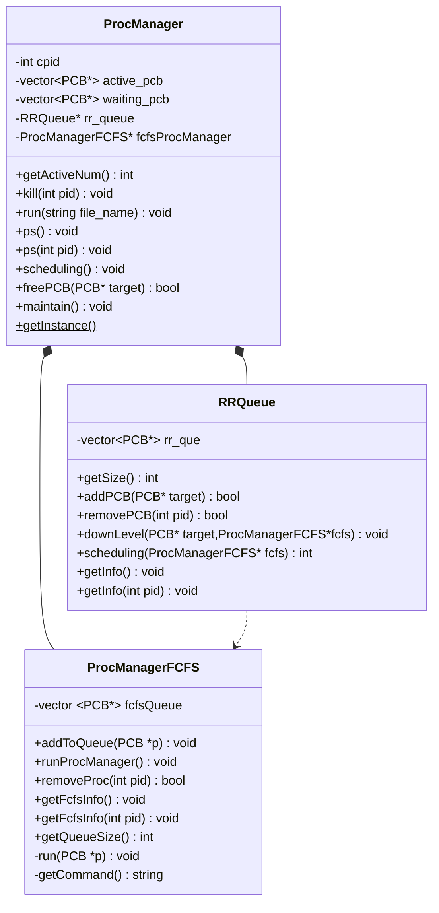
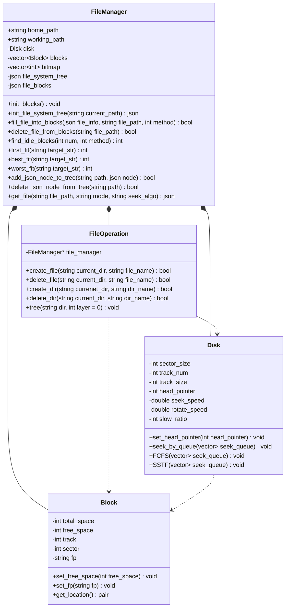

# Operating System

## 文件结构
``` text
|-- os-sys
    |-- README.md
    |-- run.sh
    |-- FileManager
    |   |-- file_manager.cpp
    |   |-- file_manager.h
    |   |-- file_operation.hpp
    |   |-- json.hpp
    |-- lib 系统共用头文件目录
    |   |-- sys.h
    |-- MemoryManager
    |   |-- README.txt
    |   |-- include
    |   |   |-- config.h
    |   |   |-- FrameTableItem.h
    |   |   |-- PageMemoryManager.h
    |   |   |-- PageTable.h
    |   |   |-- PageTableItem.h
    |   |   |-- ProcessTableItem.h
    |   |   |-- tableItem.h
    |   |-- Interface
    |   |   |-- FileManager.cpp
    |   |   |-- MemoryManager-1.cpp
    |   |   |-- MemoryManager.cpp
    |   |-- Manager
    |   |   |-- BasicPageManager.cpp
    |   |   |-- DynamicBlockManager.cpp
    |   |   |-- FrameTableItem.cpp
    |   |   |-- Log.cpp
    |   |   |-- memory.h
    |   |   |-- MyFileManager.cpp
    |   |   |-- PageMemoryManager.cpp
    |   |-- test
    |       |-- MemoryUsage.txt
    |       |-- MyFileManagerTest.cpp
    |       |-- MyFileManagerTest.exe
    |       |-- PageManagerTest-MutiThread.cpp
    |       |-- PageManagerTest-MutiThread.exe
    |       |-- PageMenagerTest.cpp
    |       |-- PageMenagerTest.exe
    |       |-- testProgram.txt
    |-- processManager 进程管理器
        |-- proc.cpp
        |-- proc.h

```

## 类图





## 存在的问题

### 内存

### 文件

### 进程


## TODO

- [ ] 4-14中期验收

## TIPS

1. 我添加了一个叫`sys.h`的头文件在`lib`目录下，如果想调用这个公共的头文件，可以在自己模块的头文件下加入`#include "../lib/sys.h"`

2. 运行`file_manager.cpp`需配合`-std=c++17`食用，可打印如下文件树：


