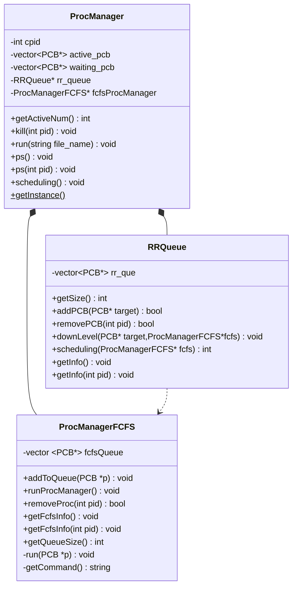
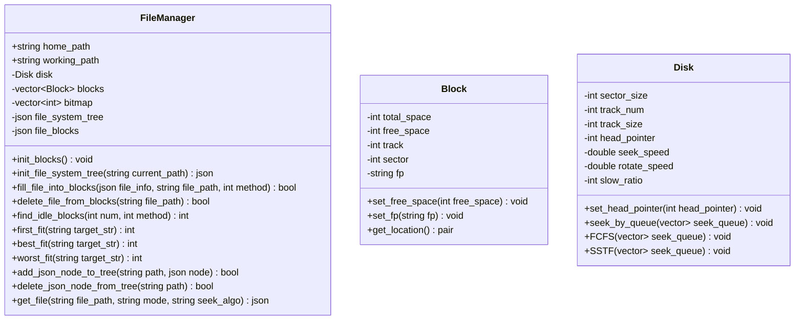

# Operating System

## 类图

## 存在的问题

### 内存

### 文件

### 进程

- [ ] fcfs对pcb的释放问题

## TODO

- [ ] 4-14中期验收

## TIPS

1. 我添加了一个叫`sys.h`的头文件在`lib`目录下，如果想调用这个公共的头文件，可以在自己模块的头文件下加入`#include "../lib/sys.h"`

2. 运行`file_manager.cpp`需配合`-std=c++17`食用，可打印如下文件树：

